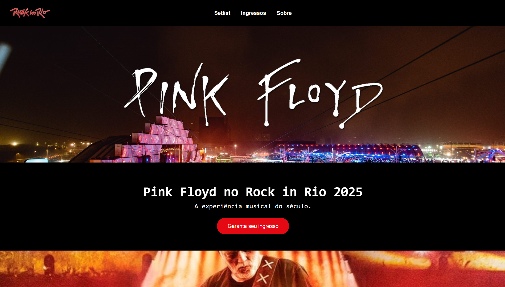

<h1 align="center">🎸 Landing Page – Show Pink Floyd no Rock in Rio</h1>

Atividade da faculdade - Landing page de um show fictício, usando HTML e CSS.

    <a href="#-projeto">Projeto</a>
    &nbsp;&nbsp;&nbsp;|&nbsp;&nbsp;&nbsp;
    <a href="#-tecnologias">Tecnologias</a>

## 💻 Projeto

Essa **landing page** foi criada como atividade da faculdade de Ciência da Computação, disciplina de Programação Web, com foco em HTML e CSS. A página apresenta informações do evento, artistas, carrossel com imagens, e botões de chamada para ação, tudo com visual inspirado em sites reais de shows e festivais.

🌐 Acesse o projeto finalizado, online, através do [link](https://rockinrio-pinkfloyd.vercel.app/).

## 🚀 Tecnologias

Esse projeto foi desenvolvido com as seguintes tecnologias:

- HTML
- CSS

## 📸 Preview

  

 

Feito com 💙 por <strong>Vitor Hugo</strong>

